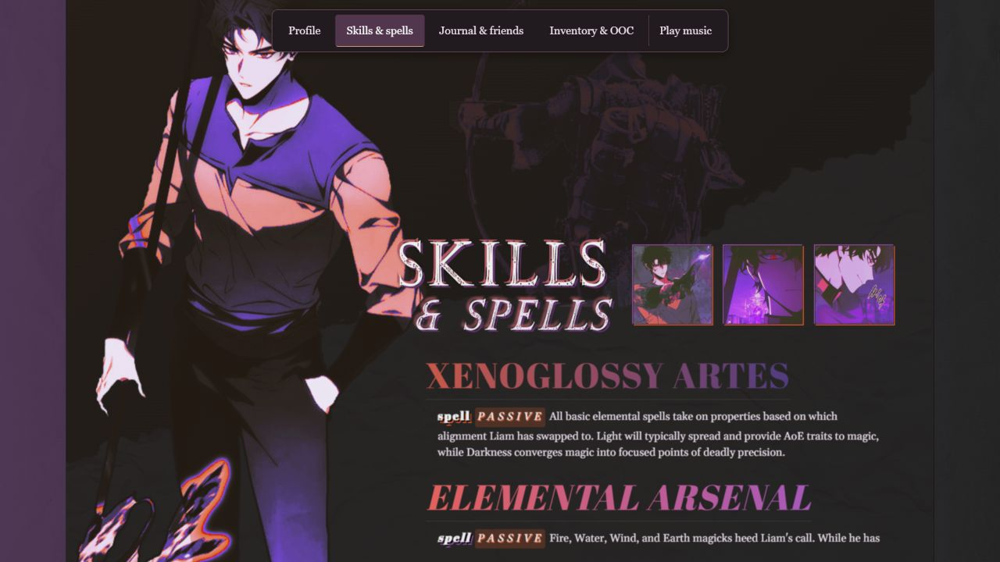

# Liam Ranvir

**Character profile · UI design & front-end development · Personal project**

An expressive character profile for an online roleplaying community, built with HTML, CSS, and vanilla JavaScript. I combined original character writing with a layered visual interface, then refined navigation and readability while preserving its desktop composition.

**My role:** Character and narrative, interface layout, and front-end implementation.

**Design constraint:** Keep the fixed desktop composition intact while making the profile easier to explore.

**[Read the case study →](ranvir/CASE-STUDY.md)**

Explore the design decisions, before-and-after comparisons, validation, and lessons learned.

[Try the desktop demo](https://stevenkhuu91.github.io/liam-ranvir-profile/ranvir/) · [View the visual walkthrough](ranvir/docs/WALKTHROUGH.md) · [Setup and source](ranvir/README.md)
