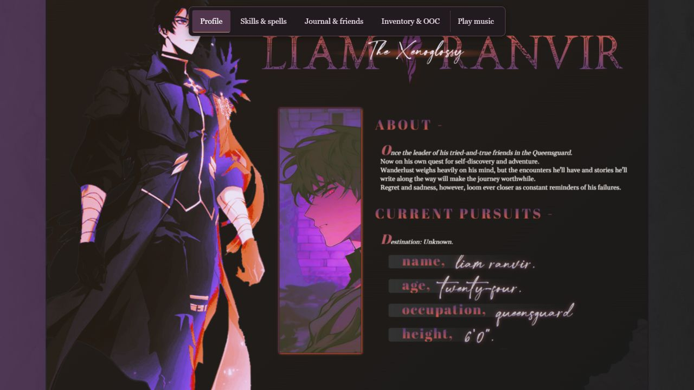

# Ranvir: an expressive character profile with clearer desktop navigation

**Personal project · UI design and front-end development · HTML, CSS, JavaScript**

[View live project](https://stevenkhuu91.github.io/front-end-projects/ranvir/) · [Project overview](README.md) · [Source code](index.html)

## Context

I created Liam Ranvir for an online roleplaying community. His profile gave me an opportunity to combine original character writing with my growing interest in front-end development. By exploring aesthetics of design, font choice, and colors, I wanted to convey his personality and tone without explicitly writing endless blocks of words; the biggest self-imposed restraint of this project was to show through imagery, not explain through text.

This was a personal design and coding project. It was not a client engagement or a formal UX research study.

## My role

I created the character, narrative, visual layout, and website implementation. The project uses HTML, CSS, and vanilla JavaScript. The comic artwork is third-party material; I did not create or claim ownership of those illustrations.

The original work focused on visual expression. Later revisions focused on making the existing desktop experience easier to explore and the code easier to maintain.

## Design intent and constraints

Layered character imagery, purple and orange accents, dark surfaces, and expressive typography establish the mood. Four horizontal sections organize the character's profile, abilities, relationships, and supporting notes. All images were edited in Photoshop, to better adapt them towards the aesthetics of the layout.

The layout was designed for desktop viewing. Preserving its composition was a deliberate constraint during the usability work. A phone layout was outside the scope of these revisions.

External images, music, and some fonts remain dependencies. That makes the full presentation dependent on those services and an internet connection.

## The challenge

The visual design gave the profile a distinct identity, but some interactions asked too much of the reader. Moving through the horizontal layout needed a clearer entry point. Music needed an understandable control. Dense text and incomplete friend entries made parts of the profile harder to read or interpret.

The question guiding the revisions was: **How could I make the page easier to explore while retaining the composition that gave it its character?**

## Changes and reasoning

### Make the sections discoverable

A persistent menu now names all four sections and highlights the current one. It provides a visible route through the profile without requiring readers to discover horizontal scrolling first.

Links support keyboard activation and have visible focus styles. The current-section indicator also updates while scrolling. Section transitions respect reduced-motion preferences.

### Give music a clear control

The music interaction became a keyboard-operable button with playback and pause states. It can cancel loading and gives feedback when the external audio cannot load.

This makes the control explain what is happening instead of relying on a decorative element alone. Playback begins with a user action.

### Improve readability within the existing panels

Skills and out-of-character text had spacing that allowed headings and paragraphs to crowd each other. Revisions increased text size and line spacing, added consistent gaps, and left-aligned body copy.

The panels retained their existing dimensions and placement. The tradeoff is that longer content may require more scrolling inside a panel, but headings and paragraphs are easier to distinguish.

### Make friend selection feel complete

Placeholder friend entries were removed. Eris now appears as the initial friend instead of leaving the area without a selected card. Selecting another friend updates the visible card and highlights the corresponding link.

The cards retain the same frame, so changing the selection does not rearrange the surrounding composition.

### Clarify the content and maintain the code

The narrative received a spelling and grammar pass while retaining its fantasy terminology and voice. The out-of-character section now explains the project's purpose, my contribution, and the distinction between original writing and third-party artwork.

The original single-file implementation was separated into HTML, CSS, and JavaScript files. Subsequent refinements were made through focused branches and pull requests, keeping changes reviewable.

## Validation and outcome

Desktop checks included 1440 × 1000 and 1366 × 768 browser viewports during the usability revisions. Checks covered section navigation, keyboard activation, friend selection, and browser Back behavior.

For the spacing changes, heading-to-paragraph gaps and selected panel, title, and artwork-container positions were compared. Those checks supported retaining the existing composition while changing text spacing.

The live GitHub Pages site was also opened for this documentation pass, and the artwork rendered in that browser session. The screenshot above records the profile at 1280 × 720.

The result is a more complete desktop demonstration: readers have visible section navigation, clearer playback feedback, more consistent text spacing, and an initial friend selection. These are observed implementation improvements, not measured usability gains. No formal participant study, comprehensive accessibility audit, or broad cross-browser study has been completed.

## What I learned

Working within a strong visual composition made the scope of each change important. Navigation could become more explicit without rebuilding the page. Text could become more readable without moving the main panels. Small interaction details, such as an initial selection and visible feedback, helped the interface explain itself.

Separating the files and reviewing changes through pull requests also made it easier to understand what each revision affected.

## Remaining work

- Observe a few desktop users finding a section, reading an ability, and switching friends; use those observations to identify remaining friction.
- Check keyboard focus and nested scrolling more thoroughly, along with contrast and additional desktop browsers.
- Complete source attribution for external artwork and music, and document any verified reuse permissions.
- Review legacy CSS and rendering-mode dependencies carefully before modernizing them.

A responsive redesign remains outside the current scope.

## Credits and ownership

Liam Ranvir, his narrative, and the website implementation are my original work. The visual artwork is adapted from a Korean comic and belongs to its respective creators and publishers. This is a personal, noncommercial project.

See the [project overview](README.md#external-asset-dependencies) for the current font, image, and audio dependencies. Source hosting is documented there; it should not be read as a claim that I created the media or hold redistribution rights.
