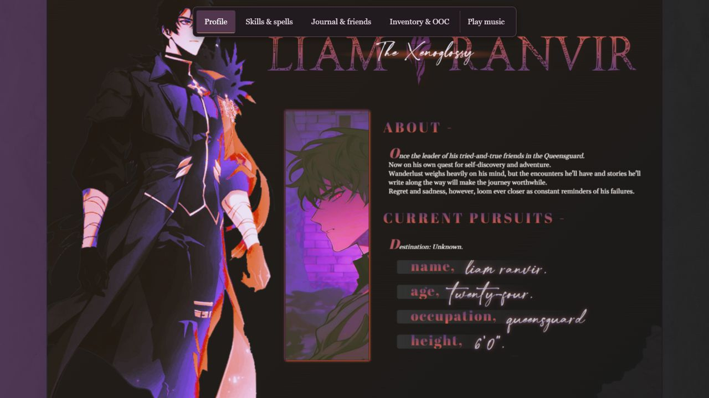
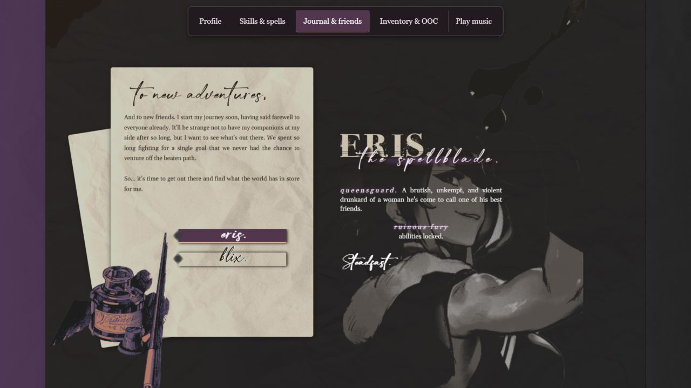

# A quick look at Ranvir

[Open the desktop demo](https://stevenkhuu91.github.io/liam-ranvir-profile/ranvir/) · [Read the full case study](../CASE-STUDY.md)

## 1. Meet the character

The profile combines a character introduction with layered imagery. Use the persistent menu to move between the four sections.

## 2. Explore an ability

Choose **Skills & spells**. Scroll inside the description panel to read the abilities while the surrounding composition stays in place.

## 3. Meet the companions

Choose **Journal & friends**. Eris appears initially; select Blix to switch the companion shown in the same frame.

Screenshots captured from the live desktop site at 1280 × 720 on September 17, 2026. External media and fonts can render differently between sessions.

**What informed these choices?** The [case study](../CASE-STUDY.md) explains the original problem, design constraints, revisions, evidence, and lessons learned.
